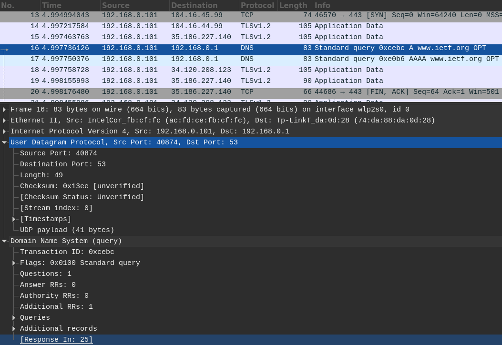
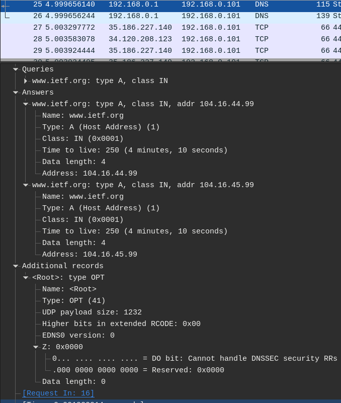
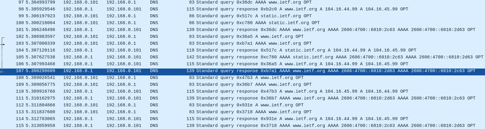
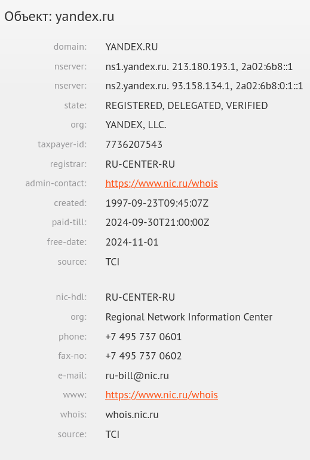
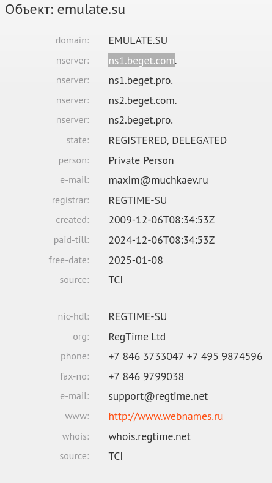

# Практика 4. Прикладной уровень


## Программирование сокетов: Прокси-сервер
Разработайте прокси-сервер для проксирования веб-страниц.
Приложите скрины, демонстрирующие работу прокси-сервера.

### Запуск прокси-сервера
Запустите свой прокси-сервер из командной строки, а затем запросите веб-страницу с помощью
вашего браузера. Направьте запросы на прокси-сервер, используя свой IP-адрес и номер порта.
Например, http://localhost:8888/www.google.com

_(*) Вы должны заменить стоящий здесь 8888 на номер порта в серверном коде,
то есть тот, на котором прокси-сервер слушает запросы._

Вы можете также настроить непосредственно веб-браузер на использование вашего прокси сервера.
В настройках браузера вам нужно будет указать адрес прокси-сервера и номер порта,
который вы использовали при запуске прокси-сервера (опционально).

### А. Прокси-сервер без кеширования (4 балла)
1. Разработайте свой прокси-сервер для проксирования http GET запросов от клиента веб-серверу
с журналированием проксируемых HTTP-запросов. В файле журнала сохраняется
краткая информация о проксируемых запросах (URL и код ответа). Кеширование в этом
задании не требуется. **(2 балла)**
2. Добавьте в ваш прокси-сервер обработку ошибок. Отсутствие обработчика ошибок может
вызвать проблемы. Особенно, когда клиент запрашивает объект, который не доступен, так
как ответ 404 Not Found, как правило, не имеет тела, а прокси-сервер предполагает, что
тело есть и пытается прочитать его. **(1 балл)**
3. Простой прокси-сервер поддерживает только метод GET протокола HTTP. Добавьте
поддержку метода POST. В запросах теперь будет использоваться также тело запроса
(body). Для вызова POST запросов вы можете использовать Postman. **(1 балл)**

Приложите скрины или логи работы сервера.

#### Демонстрация работы
todo

### Б. Прокси-сервер с кешированием (4 балла)
Когда прокси-сервер получает запрос, он проверяет, есть ли запрашиваемый объект в кэше, и,
если да, то возвращает объект из кэша без соединения с веб-сервером. Если объекта в кэше нет,
прокси-сервер извлекает его с веб-сервера обычным GET запросом, возвращает клиенту и
кэширует копию для будущих запросов.

Для проверки того, прокис объект в кеше или нет, необходимо использовать условный GET
запрос. В таком случае вам необходимо указывать в заголовке запроса значение для If-Modified-Since и If-None-Match.
Подробности можно найти [тут](https://ruturajv.wordpress.com/2005/12/27/conditional-get-request).

Будем считать, что кеш-память прокси-сервера хранится на его жестком диске. Ваш прокси-сервер
должен уметь записывать ответы в кеш и извлекать данные из кеша (т.е. с диска) в случае
попадания в кэш при запросе. Для этого необходимо реализовать некоторую внутреннюю
структуру данных, чтобы отслеживать, какие объекты закешированы.

Приложите скрины или логи, из которых понятно, что ответ на повторный запрос был взят из кэша.

#### Демонстрация работы
todo

### В. Черный список (2 балла)
Прокси-сервер отслеживает страницы и не пускает на те, которые попадают в черный список. Вместо
этого прокси-сервер отправляет предупреждение, что страница заблокирована. Список доменов
и/или URL-адресов для блокировки по черному списку задается в **конфигурационном файле**.

Приложите скрины или логи запроса из черного списка.

#### Демонстрация работы
todo

## Wireshark. Работа с DNS
Для каждого задания в этой секции приложите скрин с подтверждением ваших ответов.

### А. Утилита nslookup (1 балл)

   #### Вопросы
   1. Выполните nslookup, чтобы получить IP-адрес какого-либо веб-сервера в Азии
       ```
       nslookup www.gov.cn
       Server:         192.168.0.1
       Address:        192.168.0.1#53

       Non-authoritative answer:
       www.gov.cn      canonical name = www.gov.cn.bsgslb.cn.
       www.gov.cn.bsgslb.cn    canonical name = zgovweb.v.bsgslb.cn.
       Name:   zgovweb.v.bsgslb.cn
       Address: 156.251.67.17
       Name:   zgovweb.v.bsgslb.cn
       Address: 156.251.67.6
       Name:   zgovweb.v.bsgslb.cn
       Address: 156.251.67.8
       Name:   zgovweb.v.bsgslb.cn
       Address: 156.251.67.4
       Name:   zgovweb.v.bsgslb.cn
       Address: 128.1.77.226
       Name:   zgovweb.v.bsgslb.cn
       Address: 156.251.67.18
       Name:   zgovweb.v.bsgslb.cn
       Address: 156.251.67.7
       Name:   zgovweb.v.bsgslb.cn
       Address: 156.251.67.5
       Name:   zgovweb.v.bsgslb.cn
       Address: 156.251.67.19
       Name:   zgovweb.v.bsgslb.cn
       Address: 2a0b:21c0:5002:4::10
       Name:   zgovweb.v.bsgslb.cn
       Address: 2a0b:21c0:5002:4::a
       Name:   zgovweb.v.bsgslb.cn
       Address: 2a0b:21c0:5002:4::b
       Name:   zgovweb.v.bsgslb.cn
       Address: 2a0b:21c0:5002:4::c
       Name:   zgovweb.v.bsgslb.cn
       Address: 2a0b:21c0:5002:4::f
       ```
   2. Выполните nslookup, чтобы определить авторитетные DNS-серверы для какого-либо университета в Европе
       ```
       nslookup ox.ac.uk
       Server:         192.168.0.1
       Address:        192.168.0.1#53

       Non-authoritative answer:
       Name:   ox.ac.uk
       Address: 151.101.194.216
       Name:   ox.ac.uk
       Address: 151.101.130.216
       Name:   ox.ac.uk
       Address: 151.101.2.216
       Name:   ox.ac.uk
       Address: 151.101.66.216
       ```
   3. Используя nslookup, найдите веб-сервер, имеющий несколько IP-адресов. Сколько IP-адресов имеет веб-сервер вашего учебного заведения?
      - В вышеприведённых логах для прошлых пунктов видно, что `ox.ac.uk` и `www.gov.cn` имеют по несколько ip адресов.
      - 
      ``` 
       nslookup spbu.ru
       Server:         192.168.0.1
       Address:        192.168.0.1#53

       Name:   spbu.ru
       Address: 81.89.183.226
       ```

### Б. DNS-трассировка www.ietf.org (3 балла)

   #### Подготовка
   1. Используйте ipconfig для очистки кэша DNS на вашем компьютере.
   2. Откройте браузер и очистите его кэш (для Chrome можете использовать сочетание клавиш
   CTRL+Shift+Del).
   3. Запустите Wireshark и введите `ip.addr == ваш_IP_адрес` в строке фильтра, где значение
   ваш_IP_адрес вы можете получить, используя утилиту ipconfig. Данный фильтр позволит
   нам отбросить все пакеты, не относящиеся к вашему хосту. Запустите процесс захвата пакетов в Wireshark.
   4. Зайдите на страницу www.ietf.org в браузере.
   5. Остановите захват пакетов.

   #### Вопросы
   1. Найдите DNS-запрос и ответ на него. С использованием какого транспортного протокола
   они отправлены?
   - С использованиеам протокола UDP.
   2. Какой порт назначения у запроса DNS?
   - 53й
   3. На какой IP-адрес отправлен DNS-запрос? Используйте ipconfig для определения IP-адреса
   вашего локального DNS-сервера. Одинаковы ли эти два адреса?
   - Запрос был отправлен на локальный IP адрес маршрутизатора: `192.168.0.1`.
   - В системной кофигурации указан тот же самый IP адрес:
   ```
   cat /etc/resolv.conf
   # Generated by resolvconf
   nameserver 192.168.0.1
   options edns0
   ```
   4. Проанализируйте сообщение-запрос DNS. Запись какого типа запрашивается? Содержатся
   ли в запросе какие-нибудь «ответы»?
   - У меня уходит сразу два запроса: первый типа "A"(ipv4), второй типа "AAAA"(ipv6).
   - В запросе содержится одна запись, классифицируемая как "OPT". Почитав в интернете про неё
   пришел к выводу, что это хитрый хак: эта запись используется в качестве дополнительного поля
   для DNS протокола, чтобы не ломать обратную совместимость между версиями DNS.
   5. Проанализируйте ответное сообщение DNS. Сколько в нем «ответов»? Что содержится в
   каждом?
   - На два пакета-запроса я получил два пакета-ответа. В каждом из них (ipv4 и ipv6) содержится
   по одному запросу(запрос дублирует запрос из пакета-запроса), два ответа на запрос и одной записи "OPT".
   В ответе содержится ip адрес запрашиваемого сервера и время, на которое рекомендуется кэшировать данную запись
   (поле "Time to alive"). В случае www.ietf.org это получились адреса: `104.16.44.99 104.16.45.99`.
   6. Посмотрите на последующий TCP-пакет с флагом SYN, отправленный вашим компьютером.
   Соответствует ли IP-адрес назначения пакета с SYN одному из адресов, приведенных в
   ответном сообщении DNS?
   - Да, соответствует, последний SYN был отправлен на адрес `104.16.45.99`.
   7. Веб-страница содержит изображения. Выполняет ли хост новые запросы DNS перед
   загрузкой этих изображений?
   - К моему удивлению, хост выполняет новые DNS запросы перед загрузкой изображений. В целом
   это достаточно ожидаемо для поддомена: `static.ietf.org`, но у меня уходят DNS запросы в том числе и для
   уже отрезолвенного `www.ietf.org`, что побудило открыть конфигурацию своей dns-cache службы(nscd).
   Содержимое `/etc/nscd.conf` оказалось для меня неожиданным(в целом получается, что у меня отключен dns кэширование):
   ```
   ...
   positive-time-to-live   passwd          0
   negative-time-to-live   passwd          0
   ...
   ```

   #### Скриншоты к заданию:
   Первая пара dns запросов
   
   Ответы не первые запросы
   
   Пачка dns запросов при подгрузке "статики" сайта.
   

### В. DNS-трассировка www.spbu.ru (2 балла)

   #### Подготовка
   1. Запустите захват пакетов с тем же фильтром `ip.addr == ваш_IP_адрес`
   2. Выполните команду nslookup для сервера www.spbu.ru
   3. Остановите захват
   4. Вы увидите несколько пар запрос-ответ DNS. Найдите последнюю пару, все вопросы будут относиться к ней

   #### Вопросы
   1. Каков порт назначения в запросе DNS? Какой порт источника в DNS-ответе?
      - Порт назначения в запросе: 53.
      - Порт источника в DNS-ответе так же 53, что вполне логично.
   2. На какой IP-адрес отправлен DNS-запрос? Совпадает ли он с адресом локального DNS-сервера, установленного по умолчанию?
      - Запрос был отправлен на ip адрес: 192.168.0.1
      - Да, адрес запроса совпадает со стандартным dns сервером.
   3. Проанализируйте сообщение-запрос DNS. Запись какого типа запрашивается? Содержатся
      ли в запросе какие-нибудь «ответы»?
      - Запрашивается запись типа "A"(ipv4)
      - В отличии от предыдущего задания в запросе отсутствует OPT запись
   4. Проанализируйте ответное сообщение DNS. Сколько в нем «ответов»? Что содержится в каждом?
      - В ответном пакете, всего одна запись с ответом
      - Содержимое данной записи следующее:
      ```
      spbu.ru: type A, class IN, addr 81.89.183.226
      Name: spbu.ru
      Type: A (Host Address) (1)
      Class: IN (0x0001)
      Time to live: 10 (10 seconds)
      Data length: 4
      Address: 81.89.183.226
   
      ```

### Г. DNS-трассировка nslookup –type=NS (1 балл)
   Повторите все шаги по предварительной подготовке из Задания B, но теперь для команды `nslookup –type=NS spbu.ru`

   #### Вопросы
   1. На какой IP-адрес отправлен DNS-запрос? Совпадает ли он с адресом локального DNS-сервера, установленного по умолчанию?
       - Запрос был отправлен на ip адрес: 192.168.0.1
       - Да, адрес запроса совпадает со стандартным dns сервером
   2. Проанализируйте сообщение-запрос DNS. Запись какого типа запрашивается? Содержатся ли в запросе какие-нибудь «ответы»?
       - Запрашивается запись типа "A"(ipv4)
       - В запросе присутствует лишь одна Query запись, OPT записей нет
   3. Проанализируйте ответное сообщение DNS. Имена каких DNS-серверов университета в
   нем содержатся? А есть ли их адреса в этом ответе?
       - В ответном сообщении содержатся имена авторитетных dns серверов, где храниться запись о spbu.ru: "ns.pu.ru" и "ns2.pu.ru".
       - Их адресов в запросе нет, только доменные имена.

### Д. DNS-трассировка nslookup www.spbu.ru ns2.pu.ru (1 балл)
Снова повторите все шаги по предварительной подготовке из Задания B, но теперь для команды `nslookup www.spbu.ru ns2.pu.ru`.
Запись `nslookup host_name dns_server` означает, что запрос на разрешение доменного имени `host_name` пойдёт к `dns_server`.
Если параметр `dns_server` не задан, то запрос идёт к DNS-серверу по умолчанию (например, к локальному).

   #### Вопросы
   1. На какой IP-адрес отправлен DNS-запрос? Совпадает ли он с адресом локального DNS-сервера, установленного по умолчанию?
   Если нет, то какому хосту он принадлежит?
       - В моём случае, из-за отключенного кэширования dns произошло следующее. Сначала отправился запрос к
       dns серверу по умолчанию (192.168.0.1) для разрешения адреса "ns2.pu.ru." После получения ответа на первый запрос
       был отправлен второй запрос к dns серверу "ns.pu.ru"(195.70.196.210) на разрешение "spbu.ru" и получен второй ответ.
       Далее будет разбираться содержимое второго ответа.
       - Второй запрос был отправлен на адрес `195.70.196.210` доменным именем которого является "ns2.pu.ru". Этот хост
       является авторитетным для доменного имени "www.spbu.ru".
   2. Проанализируйте сообщение-запрос DNS. Запись какого типа запрашивается? Содержатся
   ли в запросе какие-нибудь «ответы»?
       - Запрашивается запись типа "A".
       - OPT полей в запросе не содержится, только одно поле Query
   3. Проанализируйте ответное сообщение DNS. Сколько в нем «ответов»? Что содержится в
   каждом?
       - В ответном пакете содержится две записи: по одной для доменных имен "spbu.ru" и "www.spbu.ru"
       - Запись для "www.spbu.ru" имеет тип CNAME, что указывает на то, что данное доменное имя является псевдонимом "spbu.ru".
       - Запись для "spbu.ru" иммет тип A и содержит его ipv4 адрес.

### Е. Сервисы whois (2 балла)
   #### Вопросы
   1. Что такое база данных whois?
       - Это база данных содержащая информацию о зарегистрированных IP адресах и/или доменных именах и
       контактных данных их владельцев. Может храниться как централизованно для доменной зоны или распределённо.
       Для доступа к ней существует одноимённый протокол прикладного уровня: WHOIS.
   2. Используя различные сервисы whois в Интернете, получите имена любых двух DNS-серверов.
   Какие сервисы вы при этом использовали?
       - Выполнил два whois запроса для доменов: `emulate.su` и `yandex.ru`. Их dns
       сервера это `ns1.beget.com` и `ns1.yandex.ru` соответственно.
       - Воспользовался сайтом <https://whois.tcinet.ru/>
   3. Используйте команду nslookup на локальном хосте, чтобы послать запросы трем конкретным
   серверам DNS (по аналогии с Заданием Д): вашему локальному серверу DNS и двум DNS-серверам,
   найденным в предыдущей части.
       ```
       nslookup emulate.su ns1.beget.com
       Server:         ns1.beget.com
       Address:        5.101.159.11#53
   
       Name:   emulate.su
       Address: 45.130.41.85
   
       nslookup yandex.ru ns1.yandex.ru
       Server:         ns1.yandex.ru
       Address:        213.180.193.1#53
   
       Name:   yandex.ru
       Address: 5.255.255.70
       Name:   yandex.ru
       Address: 77.88.55.60
       Name:   yandex.ru
       Address: 5.255.255.77
       Name:   yandex.ru
       Address: 77.88.55.88
       Name:   yandex.ru
       Address: 2a02:6b8:a::a
   
       nslookup emulate.su
       Server:         192.168.0.1
       Address:        192.168.0.1#53
   
       Non-authoritative answer:
       Name:   EMULATE.su
       Address: 45.130.41.85
       ```
   
   
